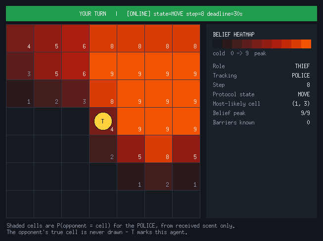
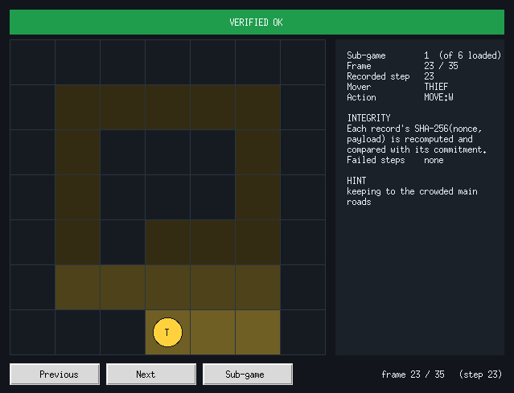
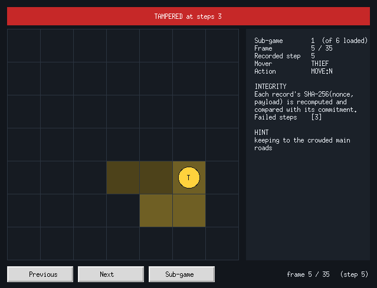
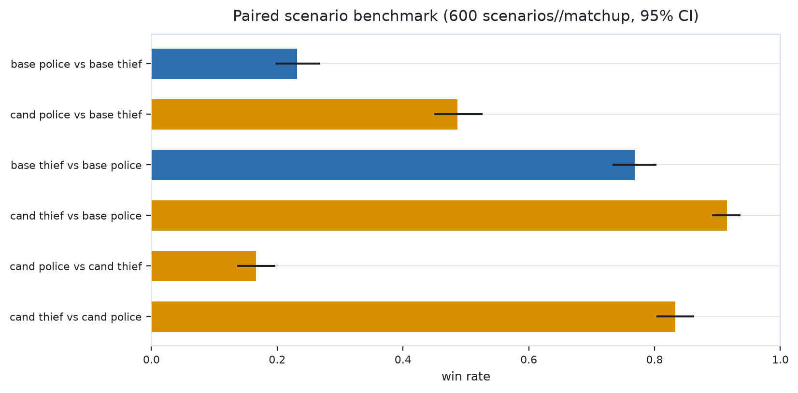
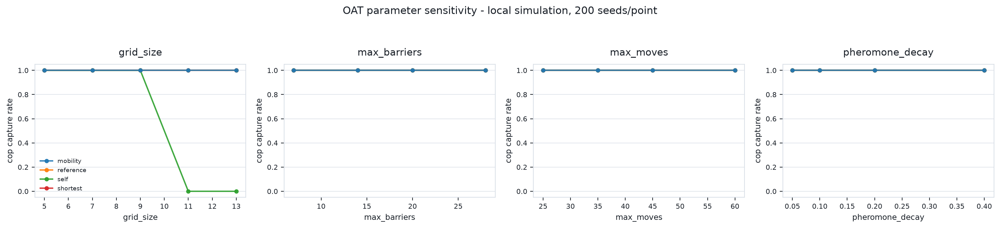
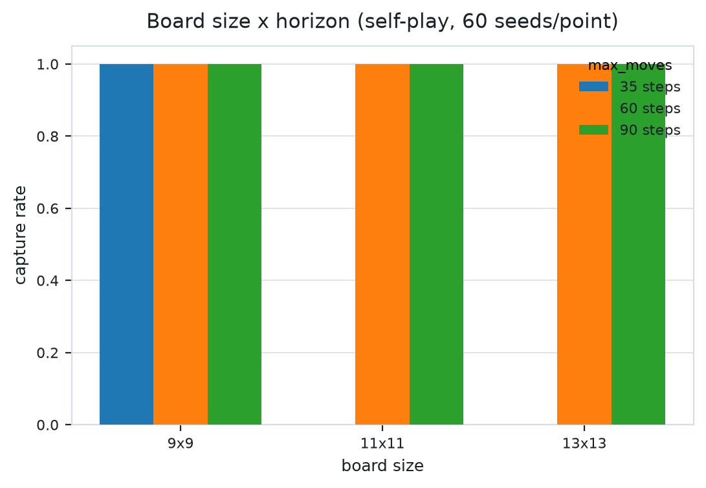
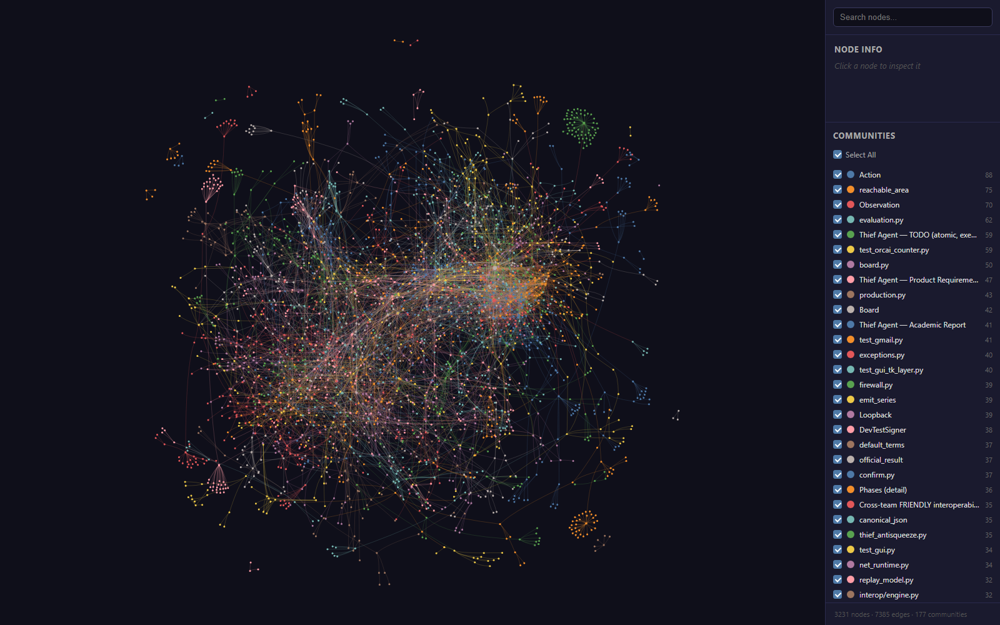
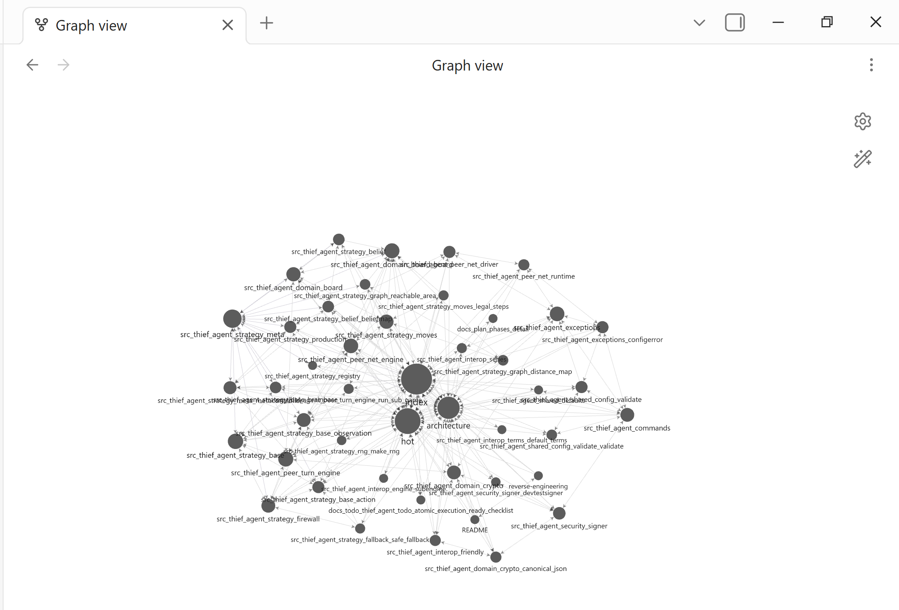
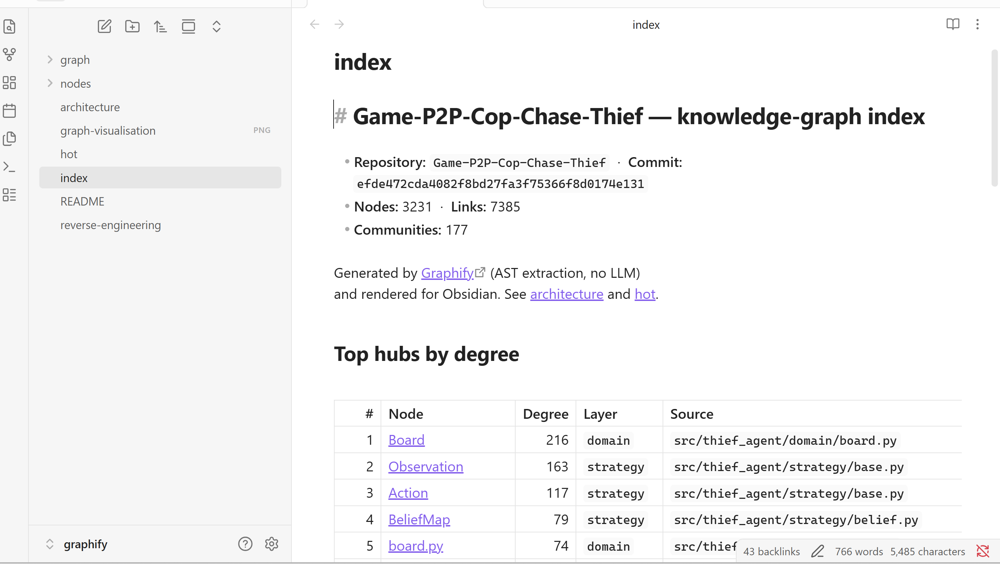
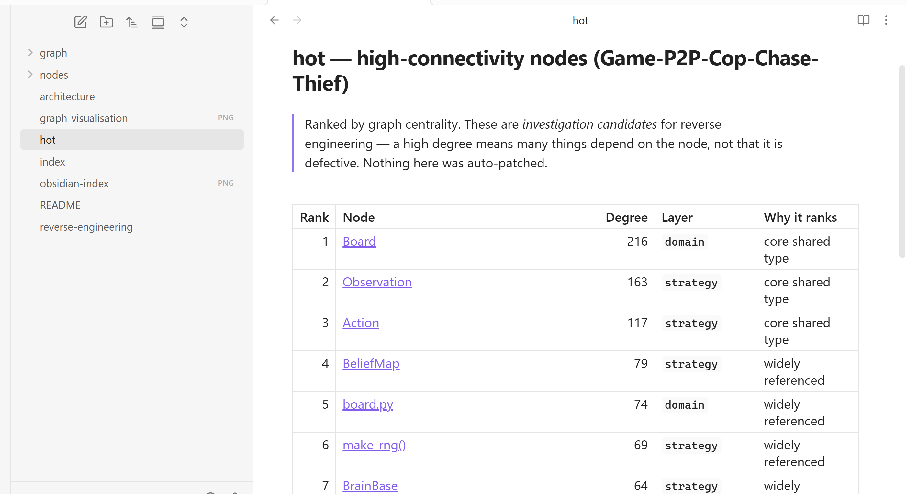

# Thief Agent — Academic Report

**Distributed Cops-and-Robbers over a Peer-to-Peer Network** — University of Haifa,
Department of Computer Science, *Orchestration of AI Agents*, final project 2026.

| | |
|---|---|
| **Group ID** | `amireman` |
| **Members** | Amir Fadila, Eman Sarhan |
| **This repository** | **Thief agent** (package `thief_agent`) |
| **Companion repository** | **[Police agent → Game-P2P-Cop-Chase-Police](https://github.com/AMIR13BD/Game-P2P-Cop-Chase-Police)** |
| **Natural role** | THIEF (the agent implements *both* roles for six-sub-game alternation) |

> This file is the academic report required by §9.4.2 and Appendix C.2 of the rulebook.
> It is a scientific document — the design decisions, their justification, and the
> empirical evidence — not an installation guide. Operational instructions are kept
> short here and expanded in [`docs/OPERATIONS.md`](docs/OPERATIONS.md).

---

## Table of contents

1. [The Dec-POMDP model](#1-the-dec-pomdp-model)
2. [FastMCP orchestration dilemmas](#2-fastmcp-orchestration-dilemmas)
3. [Strategies implemented](#3-strategies-implemented)
4. [Learning curves / reinforcement learning](#4-learning-curves--reinforcement-learning)
5. [Screenshots — Live GUI and Replay](#5-screenshots--live-gui-and-replay)
6. [Companion repository](#6-companion-repository)
7. [Empirical evidence](#7-empirical-evidence)
8. [Repository contents](#8-repository-contents)
9. [Security, secrets and integrity](#9-security-secrets-and-integrity)
10. [Reproducibility](#10-reproducibility)
11. [Token usage and project cost](#11-token-usage-and-project-cost)
12. [Repository research and quality docs](#12-repository-research-and-quality-docs)
13. [Installation, troubleshooting and contribution](#13-installation-troubleshooting-and-contribution)
14. [Submission checklist](#14-submission-checklist)
15. [Specification interpretations](#15-specification-interpretations)

---

## 1. The Dec-POMDP model

*(Rulebook §9.4.2 item 1; formalism from Chapter 1.3.)*

The race is modelled as a two-agent, zero-sum **decentralised partially observable Markov
decision process**. Neither peer observes the world state; each maintains its own belief
and acts on it. With no referee and no shared memory the process is genuinely
decentralised, not a centralised POMDP with two actuators.

**⟨I, S, {Aᵢ}, T, Ω, O, R, h⟩ as implemented in this repository**

| Element | Implementation |
|---|---|
| **I** — agents | `{police, thief}`, symmetric peers ([`constants.py`](src/thief_agent/constants.py) `Role`) |
| **S** — state space | `(cop_cell, thief_cell, barriers, step)` over a 7×7 grid, cells `(row, col)` from a top-left origin. The barrier set makes \|S\| combinatorial, so the state is never enumerated — only the Thief's reachable component is, which is the quantity that actually decides survival ([`strategy/graph.py`](src/thief_agent/strategy/graph.py)) |
| **Aᵢ** — actions | Thief: `{N,S,E,W,STAY}` only. **The Thief may never place a barrier** — the Barrier Law is a Cop privilege, and [`strategy/firewall.py`](src/thief_agent/strategy/firewall.py) degrades any such proposal to `STAY` rather than emitting an illegal action |
| **T** — transition | Deterministic movement; barriers are irreversible. All stochasticity is the opponent's policy — precisely the unobservable part |
| **Ω** — observations | An `Observation` carries **only** legally visible data: own cell, board size, public barriers, the received scent field, the last verbal hint, step index, barrier quota ([`strategy/base.py`](src/thief_agent/strategy/base.py)). It structurally **cannot** contain a Cop coordinate |
| **O** — observation model | Stigmergic pheromones: a 5×5 kernel (0.90 / 0.62 / 0.42 / 0.20 / 0.14 / 0.04) deposited each turn, decayed by ρ = 0.1, clamped at 0.9 ([`domain/smell.py`](src/thief_agent/domain/smell.py)) — a noisy, additive, saturating sensor |
| **R** — reward | Survival to step 35: Thief 10 / Cop 5. Capture: Thief 5 / Cop 20. Tie 2, technical loss 0 ([`domain/scoring.py`](src/thief_agent/domain/scoring.py)) |
| **h** — horizon | 35 steps — for the Thief this is not a horizon but *the win condition itself* |

### What the Thief's belief must actually estimate

The Thief's inference problem is not symmetric to the Cop's, and treating it as if it were
was our most expensive early mistake. The Cop wants a point estimate to chase. The Thief
needs something stronger: **the set of cells from which the Cop could end the game on its
very next action.** Because a barrier turn does not move the Cop, and the Barrier Law lets
it wall its own cell or any of the four beside it, that set is the closed neighbourhood of
the Cop's true cell — so a merely *probable* estimate is not enough; a confidently wrong
one is fatal.

Two inference layers serve this:

* **[`strategy/belief.py`](src/thief_agent/strategy/belief.py) `BeliefMap`** — the baseline
  normalised posterior over passable cells with a small floor.
* **[`strategy/cop_locate.py`](src/thief_agent/strategy/cop_locate.py) `CopLocator`** — a
  maximum-likelihood tracker. One turn of the Cop's field is
  `τ ← (1−ρ)·min(cap, τ_prev + K(d))`, so given the *previous* broadcast we can predict the
  next one for every hypothetical Cop cell and keep the hypothesis with the smallest error.
  This beats a raw argmax (which saturates into a plateau of tied cells) and beats a plain
  delta peak (which collapses when the Cop stands still on an already-saturated cell). It is
  fused with an exact geometric constraint: **a freshly declared barrier confines the Cop to
  at most five cells**, because Rule 15 makes every wall public and the Barrier Law fixes
  where it may be placed. Measured on real games this locator is **100 % exact**.

  One subtlety cost us 19 % of localisation accuracy until it was found: the Cop may wall
  **the cell it is standing on** (`SELF`), so a barrier is *not* evidence of absence.
  Filtering barrier cells out of the hypothesis set silently discarded the true cell.

**Uncertainty as a resource** (Chapter 1.4). The asymmetry protects us too, and we spend
effort keeping it that way: we emit the *additive spec* scent field rather than a max-merged
one. A max-merge would leave our current cell as a unique 0.9 peak — a perfect localiser
handed to an adversarial Cop. Emitting the saturating field is a deliberate decision to stay
legally hard to localise ([`peer/net_engine.py`](src/thief_agent/peer/net_engine.py),
`emission="spec"`).

---

## 2. FastMCP orchestration dilemmas

*(Rulebook §9.4.2 item 2; Chapters 2 and 8.)*

Every peer is **simultaneously a server and a client** over FastMCP 3.4.5. There is no
central server: our MCP server *is* our public mailbox.

### 2.1 The four receive tools and why the surface is this small

[`interop/server.py`](src/thief_agent/interop/server.py) exposes exactly four tools —
`negotiate`, `receive_turn`, `submit_audit`, `receive_control` — with names and argument
names mirroring the reference exactly. Each drops its message into a thread-safe queue and
returns. **No tool blocks and no tool computes.** A handler that waited for our own turn
would deadlock the instant both peers waited on each other.

### 2.2 Turn management — the ordering dilemma, from the Thief's side

Implemented in [`interop/runtime.py`](src/thief_agent/interop/runtime.py):

* Rounds are **thief-first, then police** — as the Thief we *open* every sub-game, and we
  commit to a cell before seeing the Cop's reply to it.
* The Cop declares a capture claim on its own post-move cell **every** turn. We answer every
  claim truthfully; a false denial would be provable at the audit and would cost the match.
* We are caught iff the claim names our current cell, a declared barrier lands on our cell
  (R46), or a barrier leaves us with no legal move (R47)
  ([`peer/net_engine.py`](src/thief_agent/peer/net_engine.py) `receive`).
* **Stepping onto the Cop is not an auto-capture** — with no referee, capture exists only
  once declared and confirmed. We nevertheless treat co-location as fatal in the strategy,
  because relying on an opponent's failure to claim is not a defence.
* Once caught we seal a `HOLD` and make **no further move** — `concede()` in
  [`interop/engine.py`](src/thief_agent/interop/engine.py). A caught Thief that kept moving
  would be manufacturing an illegal history.
* On reaching step 35 we raise the **survival win-claim** ourselves; the sub-game ends on our
  own 35th move rather than waiting for the peer.

### 2.3 Network-failure handling

| Failure | Mechanism |
|---|---|
| Peer goes silent | [`peer/deadline.py`](src/thief_agent/peer/deadline.py) bounds every wait; a per-turn timeout classifies the sub-game, never hangs |
| Peer stalls mid-series | [`peer/watchdog.py`](src/thief_agent/peer/watchdog.py) heartbeats and forces a deterministic technical loss |
| Transport drop | [`interop/series.py`](src/thief_agent/interop/series.py) isolates the failure to **one sub-game** and reconnects; the series survives |
| Duplicate / reordered / replayed turns | `Inbox` (window 4) enforces exactly-once, in-step-order delivery and raises on equivocation |
| Malformed envelope | Rejected with a reason and a strike — nothing in the receive path may raise, because a crashed peer forfeits |
| Straggler audit after a role swap | Audits bucketed by explicit `sub_game_number`, never by arrival order |

### 2.4 Gatekeeper and Orchestrator

**Gatekeeper** ([`shared/gatekeeper.py`](src/thief_agent/shared/gatekeeper.py)) is the
protective layer between an autonomous agent and a live account: a **token-bucket** rate
limiter ([`shared/rate_limiter.py`](src/thief_agent/shared/rate_limiter.py)) plus a hard
admission capacity of `concurrent_requests + queue_depth`, raising `RateLimitError` /
`QueueFullError` instead of hammering an endpoint. It matters most on the outbound Gmail
path: a Google `429` is not a transient blip, and retrying blindly through it risks account
suspension — so we back off and wait for the next window.

**Orchestrator** — the layered state machine that owns the game, so strategy never touches
the wire:

```
SeriesRuntime      six sub-games, role alternation, consensus, reporting   interop/series.py
   └── SubGameRuntime   one sub-game: turn loop, deadline, mutual audit    interop/runtime.py
         └── SubEngine  wire ⇄ engine translation, capture round-trip      interop/engine.py
               └── PeerHalf   own secret state, sealing, scent, claims     peer/net_engine.py
                     └── Brain   pure decide(Observation) -> Action        strategy/
```

Separation of concerns (Chapter 8.2) is structural: a brain takes an `Observation` and
returns an `Action`, and **every** action passes
[`strategy/firewall.py`](src/thief_agent/strategy/firewall.py), which substitutes a safe
legal fallback for any illegal proposal and counts the substitution. A buggy or adversarial
strategy cannot put an illegal move on the wire.

---

## 3. Strategies implemented

*(Rulebook §9.4.2 item 3; Chapter 6. This is the Thief-side report — the companion
repository documents the same engine from the Cop's side.)*

The move is **always pure Python and always deterministic under a fixed seed.** A language
model never selects a move.

### 3.1 The Thief's problem — and why distance is the wrong objective

The obvious evader maximises Manhattan distance from the pursuer. It loses, and the
measurements say exactly how. Against the current league opponent's Cop, **every single
loss was barrier-driven** — their Rule-46 pounce (a wall dropped on our cell from an adjacent
Cop) or Rule-47 enclosure — and **not one** was a chase. Maximising distance walks straight
into the board edge, where a shrinking component and a one-wall seal finish the job.

The correct objective is therefore not separation but **the shape of the space we keep**.
Distance is demoted to a hard constraint; topology becomes the thing we optimise.

### 3.2 The portfolio

| Brain | Idea |
|---|---|
| `ThiefDistanceBrain` | Baseline: maximise distance from the belief argmax |
| `EscapeBrain` / `EvadeBrain` | Distance with mobility and escape-route awareness |
| `EntropyBrain` | Prefer moves that keep the pursuer's posterior diffuse |
| `DecornerBrain` | Explicit recovery away from corners |
| `EndgameBrain` | Guaranteed-survival play near the threshold |
| `SurvivorBrain` | Safety-constrained mobility with anti-oscillation history |
| **`AntiSqueezeBrain`** | **Current default** — survival-topology evasion (§3.3) |
| `MetaController` | Portfolio controller selecting a brain per turn |

### 3.3 `AntiSqueezeBrain` — optimising survival topology

[`strategy/thief_antisqueeze.py`](src/thief_agent/strategy/thief_antisqueeze.py).

**Hard constraints first**, each applied only while a legal move still survives it:

0. never step onto a cell the Cop may occupy;
1. never end **within one step** of any plausible Cop cell — exactly the pounce range, since
   a barrier turn does not move the Cop and it may wall its own cell or any of the four
   beside it;
2. never accept a cell whose component **one further wall** could collapse.

**Then the objective**, over whatever survives: the worst-case reachable area after the
Cop's best single wall (the anti-squeeze term, and the primary one), current area with the
Cop treated as blocked, the number of safe exits, vertex-disjoint routes to the frontier,
open degree, articulation-point avoidance, corner clearance while the Cop still holds walls,
and anti-loop history. Distance survives only as a tie-break.

The anti-loop term does double duty. Their Cop unlocks its squeeze behaviour only after its
stall detector sees a **repeated `(cop, thief)` position pair**; refusing to replay positions
denies it that trigger entirely.

Two findings were worth more than any coefficient:

* **Deleting the endgame branch.** The earlier evader switched, near step 35, to a
  distance-and-degree score that dropped the corner and `STAY` penalties. It then parked in
  a corner for the last six turns and was walled in. That branch was the *only* remaining
  loss mode once the pounce was closed; removing it took survival from 90 % to 100 %.
  Enclosure is exactly as fatal on step 34 as on step 4, so one objective now governs
  throughout.
* **Fix the objective before improving the sensor.** Feeding a sharper Cop estimate into the
  old distance-first policy made results *worse* — a better estimate simply sharpened the
  flight into the corner. The `CopLocator` of §1 only became an asset after the objective
  was corrected.

### 3.4 Exploiting an opponent's model of us

Their Cop searches for forced capture lines while simulating our replies with a *pure
max-distance flee* model. Because `AntiSqueezeBrain` is not that policy, their "forced"
lines are not forced — a modelling error we obtain for free simply by having the right
objective. The symmetric Cop-side counter is documented in the companion repository.

### 3.5 Verbal hints and the LLM boundary

Hints are free text ≤ 15 words, sanitised for digits, hex blobs and secret-like tokens
([`strategy/hint_filter.py`](src/thief_agent/strategy/hint_filter.py)), so a hint can never
leak a coordinate. Our hints are deliberately compass-free: a parseable direction — true or
false — is information an opponent's detector can exploit in either direction.

An optional OpenAI **advisor** (`gpt-5.4-mini`, [`advisor/`](src/thief_agent/advisor)) may
act as a *selector* over deterministic candidates: the engine generates the legal candidate
set and a fallback, the model picks an `action_id`, and the result passes strict validation,
a hard-safety veto and the firewall. It is **disabled by default** (`OPENAI_ADVISOR`), so
the test suite makes zero API calls and league play is fully deterministic.

---

## 4. Learning curves / reinforcement learning

*(Rulebook §9.4.2 item 4 — conditional on RL being used.)*

**No reinforcement learning is used, so no learning curves are reported.** The rulebook
lists Q-Learning as *one optional tool* (Chapter 6.3) and we deliberately declined it: a
35-step horizon over a combinatorial barrier state yields far too little on-policy data for
tabular Q-learning to converge, and an unconverged policy is strictly worse than a correct
deterministic one. Effort went instead into exact opponent modelling, maximum-likelihood
localisation and topological search — all reproducible and auditable, which an under-trained
policy is not.

The measured strategy comparison in §7 replaces a learning curve as empirical evidence; it
comes from a protocol-faithful harness rather than a training loop.

---

## 5. Screenshots — Live GUI and Replay

*(Rulebook §9.4.2 item 5 — **absolute requirement**; Chapter 7. The requirement is not
formal: the belief map demonstrates genuine probabilistic inference under partial
observation, and `VERIFIED OK` demonstrates that game integrity was cryptographically
preserved.)*

Both are real Tkinter windows. Everything they draw is computed by the same modules the
agent itself uses — the belief heatmap by `strategy/belief.py` and `domain/smell.py`, the
integrity verdict by `gui/replay_verify.py` — so the windows are a presentation layer, never
a second implementation. The images below are unretouched captures of those windows.

### 5.1 Live GUI — board and belief heatmap



```bash
# generate a deterministic local match that records both tracks, then open the window
uv run python -m thief_agent artifacts --out /tmp/demo --game-id demo --seed 7
uv run python -m thief_agent view --gui --replay-dir /tmp/demo --game-id demo --step 8
```

Window: [`gui/tk_live.py`](src/thief_agent/gui/tk_live.py) and
[`gui/tk_canvas.py`](src/thief_agent/gui/tk_canvas.py); view-model:
[`gui/live_model.py`](src/thief_agent/gui/live_model.py); colours:
[`gui/palette.py`](src/thief_agent/gui/palette.py).

**What the shading means.** Each cell is shaded by *P(opponent = cell)* — bucket 0 (dark)
to bucket 9 (bright red-orange), normalised against the posterior peak. That posterior is
produced by the same `BeliefMap` the strategies consult, updated from the opponent's
received scent field and nothing else. **No opponent position is ever drawn**: only one
marker appears on the board, and it is this agent. The Thief window therefore shows the Thief's
belief about the Cop; the Cop window in the companion repository shows the mirror image.

**Turn indicator** (Chapter 7.3.2): the banner is **green `YOUR TURN`** while the protocol
is in a move-accepting state and **grey `LOCKED`** otherwise, driven by the existing
`status_banner.input_locked`, so the banner cannot disagree with the state machine.

**Where the numbers come from.** `--replay-dir` replays a recorded match's trajectories
through the real emission kernel (`domain/smell.step_update`) to rebuild the exact scent an
agent perceived, then feeds it to the real `BeliefMap`
([`gui/evidence.py`](src/thief_agent/gui/evidence.py)). Nothing is invented for the
screenshot; the capture tool refuses to shoot a uniform map. Without `--replay-dir` the
window opens on the step-1 opening position, whose posterior is legitimately flat.

### 5.2 Replay App — stepping through a match with per-step verification



```bash
uv run python -m thief_agent replay --dir docs/evidence/G020 --game-id G020 --gui
```

Window: [`gui/tk_replay.py`](src/thief_agent/gui/tk_replay.py); panel helpers:
[`gui/replay_panel.py`](src/thief_agent/gui/replay_panel.py); stepping and verdict:
[`gui/replay_model.py`](src/thief_agent/gui/replay_model.py) over the pre-existing
[`gui/replay_verify.py`](src/thief_agent/gui/replay_verify.py).

**Previous** and **Next** walk the reconstructed frames (disabling themselves at the ends);
**Sub-game** cycles through the six logs; the counter reports `frame N / M (step S)`; the
board shows the recorded track with recency shading.

**The badge is a result, not a label.** For every record the viewer recomputes
`SHA-256(nonce, payload)` and compares it with the stored commitment. It paints green
`VERIFIED OK` only when every step reconciles, and red `TAMPERED at steps …` otherwise. The
capture above is the **official counted match G020 vs `Orcai-MJ`** (90 : 30, 6–0), whose
logs are committed under [`docs/evidence/G020/`](docs/evidence/G020/); all six sub-games
verify.

To show that the green badge is earned rather than hard-coded, the same viewer over the
same logs with one record deliberately corrupted in memory:



**Reproducing the images.** [`scripts/capture_gui.py`](scripts/capture_gui.py) opens the
window and photographs it with `ffmpeg -f x11grab`; it aborts rather than capture a uniform
belief map or a verdict that does not match `--expect`.

---

## 6. Companion repository

*(Rulebook §9.4.2 item 6 and rule 49 — the cross-link is mandatory in both directions.)*

| Repository | Link |
|---|---|
| **Thief (this repo)** | https://github.com/AMIR13BD/Game-P2P-Cop-Chase-Thief |
| **Police (companion)** | **https://github.com/AMIR13BD/Game-P2P-Cop-Chase-Police** |


### 6.1 League interoperability contract

The shape a peer must meet to play us a counted series. All of it is enforced in
`src/thief_agent/interop/`.

| | |
|---|---|
| **Group** | `amireman` — Amir Fadila, Eman Sarhan |
| **Series** | 6 sub-games, **roles alternate** — natural role on odd sub-games, the opposite on even ones |
| **Turn order** | **thief-first**: the Thief opens every sub-game; the Cop's loop waits for the first inbound turn |
| **Endpoint** | **one unified MCP endpoint serves both our roles**. Role alternation happens inside a single server process, so one URL is advertised for `cop` and `thief` alike — and a peer must do the same, because a series dials one fixed peer URL for all six sub-games |
| **Tools** | `negotiate(message)`, `receive_turn(message)`, `submit_audit(payload)`, `receive_control(message)` |
| **Terms** | the 14 signed terms, compared for exact value equality; signature is `SHA256(canonical(terms)｜nonce)` |
| **Settlement** | per-sub-game mutual audit, then an explicit **exchange** of the series digest — a locally computed hash never confirms anything on its own |
| **Consensus profiles** | `legacy` (default) and **`official_reference_v1`**, agreed per pairing out of band, never inside the signed terms |
| **Commit reporting** | **role-specific**: each sub-game declares the SHA of the repository that actually played it (Police repo for the cop sub-games, Thief repo for the thief ones), with an additive `github_commits` map alongside. Commit fields never enter the consensus digest |
| **Production strategies** | Police = `RingBreakerBrain` (opponent model graded against the scent actually broadcast, falling back to `ContainBayesBrain` when the model stops fitting); Thief = `AntiSqueezeBrain` |

Public endpoints are created per match and expire, so no tunnel URL is published here.

---

## 7. Empirical evidence

### 7.1 League matches played (counted)

Seven counted six-sub-game series against seven different groups. Every sub-game log verified
untampered on both sides.

| Game | Opponent | Score (`amireman` : opponent) | Sub-games | Result | Logs verified | Committed evidence |
|---|---|---|---|---|---|---|
| `G002` | `uoh-ay26` | 40 : 60 | 2 : 4 | loss | 6/6 ✔ | [`docs/evidence/G002/`](docs/evidence/G002/) |
| `G005` | `saedshki` | 47 : 47 | 3 : 3 | tie | 6/6 ✔ | [`docs/evidence/G005/`](docs/evidence/G005/) |
| `G008` | `sharNamr` | 47 : 47 | 3 : 3 | tie | 6/6 ✔ | [`docs/evidence/G008/`](docs/evidence/G008/) |
| `G012` | `ahk-yosi` | 40 : 60 | 2 : 4 | loss | 6/6 ✔ | [`docs/evidence/G012/`](docs/evidence/G012/) |
| `G020` | `Orcai-MJ` | **90 : 30** | **6 : 0** | **win** | 6/6 ✔ | [`docs/evidence/G020/`](docs/evidence/G020/) |
| `G040` | `salareen` | **90 : 30** | **6 : 0** | **win** | 6/6 ✔ | [`docs/evidence/G040/`](docs/evidence/G040/) |
| `G077` | `ali-ahm1` | **90 : 30** | **6 : 0** | **win** | 6/6 ✔ | [`docs/evidence/G077/`](docs/evidence/G077/) |
| **Total** | **7 series** | **444** | **28 : 14** | **3 wins · 2 ties · 2 losses** | **42/42 ✔** | all seven replayable |

This satisfies the "at least two games against different groups" threshold with seven.
Raw counted total across all seven series: **444 points**.

**Every counted match is replayable from this repository.** All seven series ship their six
`log_*.json` records *and* the six cryptographically locked `config_*.json` files they were
played under — the per-game configuration attachment Appendix F's *Mandatory Rules* require.
The four matches that predate the evidence directory (`G002`, `G005`, `G008`, `G012`) also
ship their signed `result_*.json`. `declaration_*.json` is withheld throughout: it embeds the
ephemeral match-day tunnel endpoints. Each directory's `README.md` derives the sub-game
outcomes from the logs and checks that they sum to the `sub_games_won` figure in the mutually
agreed result record.

```bash
for g in G002 G005 G008 G012 G020 G040 G077; do
  uv run python -m thief_agent replay --dir docs/evidence/$g --game-id $g
done
```

**One settlement caveat, stated rather than smoothed over.** In `G005` the score was mutually
agreed (`results_agreed: true`) but the two peers' settlement *digests* differed
(`sha_match: false`, so `confirmed: false`), because the opponent serialised the result
envelope to a different field shape than we did. The other six matches settled with
`confirmed: true`. Details in [`docs/evidence/G005/README.md`](docs/evidence/G005/README.md).


#### G077 — the final counted series (vs `ali-ahm1`)

The last counted match, and the third consecutive 6–0.

| | |
|---|---|
| **Game id** | `G077` |
| **Opponent** | `ali-ahm1` |
| **Final score** | **`amireman` 90 : 30 `ali-ahm1`** |
| **Sub-games** | **6 : 0** (six wins, no losses, no ties) |
| **Audit status** | all six sub-game logs verified untampered on both sides |
| **Result consensus** | `results_agreed` and `sha_match` both `true`; `mutual_agreement.confirmed` = `true` |
| **Consensus digest** | `d93188454b5b24c01d4c3390904446626c4b6439d22887a9ef543dbf1f6f4b32` |
| **Consensus profile** | `official_reference_v1` |
| **Gameplay LLM tokens** | 0 for both groups (see §11) |

| Sub-game | Our role | Outcome | Steps | Log verified |
|---|---|---|---|---|
| 1 | thief | survival | 35 | ✔ |
| 2 | police | capture | 12 | ✔ |
| 3 | thief | survival | 35 | ✔ |
| 4 | police | capture | 12 | ✔ |
| 5 | thief | survival | 35 | ✔ |
| 6 | police | capture | 19 | ✔ |

Our Thief survived the full 35-step horizon in all three sub-games it defended, and our Cop
captured in all three it pursued. Each sub-game declares the SHA of the repository that
actually played it: Thief `17b83bf1d0f4c9ce338fa04f6252b6a105c76da1` on
`g01`/`g03`/`g05`, Police `6e8bc146b5e667286e6ceb80fc61edaeb9109dec` on
`g02`/`g04`/`g06`.

The six logs are committed under [`docs/evidence/G077/`](docs/evidence/G077/):

```bash
uv run python -m thief_agent replay --dir docs/evidence/G077 --game-id G077
```

#### G040 — vs `salareen`

| | |
|---|---|
| **Final score** | **`amireman` 90 : 30 `salareen`** — 6 : 0 |
| **Result consensus** | `results_agreed`, `sha_match` and `confirmed` all `true` |
| **Consensus digest** | `052219681e9eb0f7d079993428de7d25f909889b95c45c9b5e5a7563663f3e5d` |

Same shape as G077: thief survival at 35 steps on `g01`/`g03`/`g05`, police capture at 12
steps on `g02`/`g04`/`g06`. Logs under [`docs/evidence/G040/`](docs/evidence/G040/).

#### G020 — the replay-screenshot series (vs `Orcai-MJ`)

The series the replay screenshot in §5.2 is taken from.

| | |
|---|---|
| **Game id** | `G020` |
| **Opponent** | `Orcai-MJ` |
| **Final score** | **`amireman` 90 : 30 `Orcai-MJ`** |
| **Sub-games** | **6 : 0** (six wins, no losses, no ties) |
| **Audit status** | all six sub-game logs verified untampered — no `TAMPERED` step on either side |
| **Result consensus** | mutual agreement confirmed; both peers' result digests matched |
| **Gameplay LLM tokens** | 0 for both groups (see §11) |

Per sub-game, alternating roles under the six-sub-game contract:

| Sub-game | Our role | Outcome | Steps | Log verified |
|---|---|---|---|---|
| 1 | thief | survival | 35 | ✔ |
| 2 | police | capture | 9 | ✔ |
| 3 | thief | survival | 35 | ✔ |
| 4 | police | capture | 9 | ✔ |
| 5 | thief | survival | 35 | ✔ |
| 6 | police | capture | 9 | ✔ |

Our Thief survived the full 35-step horizon in every sub-game it defended, and our Cop
captured in 9 steps in every sub-game it pursued — the clean 6–0 that the
`RingBreakerBrain` / `AntiSqueezeBrain` counters were built for.

The six logs backing this table are committed under
[`docs/evidence/G020/`](docs/evidence/G020/), so the verdict is reproducible:

```bash
uv run python -m thief_agent replay --dir docs/evidence/G020 --game-id G020
```

The series was played by our peer runtime at commit
`71ce1d4442dcb7303d1a0f19f0af00e93b453c91`, recorded in the match declaration as required.

### 7.2 Strategy measurement — protocol-faithful harness

Measured with the wire capture semantics of §2.2 (thief-first rounds, claim/barrier/
enclosure only, no auto-capture), driving our real `PeerHalf` against the agents an
opponent had published at the time. 100 games per cell.

| Matchup | Previous default | Current default |
|---|---|---|
| Our Thief vs their Cop | 37/100 survivals | **100/100 survivals** |
| Our Cop vs their Thief | 0/100 captures | **100/100 captures** (avg step 9.0, 0 barriers) |

> **Provenance, stated plainly.** This table is the one measurement in this README that
> **cannot be reproduced from this repository alone**: the opposing brains are a third party's
> code, read from their public repository at the time and never vendored here, so no committed
> file or command below regenerates these two rows. They are reported because they drove a real
> design decision, not as independently checkable evidence. The claim they support *is*
> independently checkable, from committed data, in the strongest available form: the counted
> match **G020 against that same opponent finished 6–0, with all six sub-game logs verified
> untampered on both sides** ([`docs/evidence/G020/`](docs/evidence/G020/)). Treat §7.1 as the
> evidence and this table as the design note that preceded it.

The Thief result decomposes cleanly: the previous default lost 63/100, of which **every**
loss was a Rule-46 pounce. Closing the pounce range (§3.3 constraint 1) removed all of them;
deleting the endgame branch removed the residual Rule-47 enclosures.

Against our own held-out sparring registry ([`sim/opponents/`](src/thief_agent/sim/opponents))
the current Thief matches or beats the previous default on every opponent, including the
`corner_trap` pursuer where survival goes from 0.00 to 1.00 — the corner death was a real,
general weakness, not a matchup artefact.

Reproduce the sparring evaluation and ablations:

```bash
uv run python -m thief_agent tournament --seeds 8     # held-out champion selection
uv run python scripts/champion_eval.py                # evaluation harness
```

Tracked evidence: [`evidence/scenario_matchups.csv`](evidence/scenario_matchups.csv),
[`evidence/strategy_summary.json`](evidence/strategy_summary.json),
[`evidence/thief_trap_fix.csv`](evidence/thief_trap_fix.csv). Method and ablations:
[`docs/STRATEGY_EVALUATION.md`](docs/STRATEGY_EVALUATION.md),
[`docs/STRATEGY_ABLATION.md`](docs/STRATEGY_ABLATION.md),
[`docs/SELF_PLAY_METHOD.md`](docs/SELF_PLAY_METHOD.md).

### 7.3 Test suite

**750 tests passing.** Coverage gate `fail_under = 85`; `ruff` lint + format; a 150-line
per-file limit; and an automated secret scan — all enforced in CI
([`.github/workflows/ci.yml`](.github/workflows/ci.yml)).

```bash
uv run pytest                                   # full suite
uv run python scripts/secret_scan.py            # secret scan
uv run python scripts/check_line_count.py       # size gate
```

---

## 8. Repository contents

*(Rulebook §9.4.1 and rule 50 — README, `config/`, PRD, PLAN and TODO are all mandatory.)*

| Required | Location |
|---|---|
| Academic report | `README.md` (this file) |
| Configuration | [`config/game.json`](config/game.json) (signed shared contract), `config/game.json.example`, `config/game.toml.example`, [`schemas/config.schema.json`](schemas/config.schema.json) |
| PRD | [`docs/PRD.md`](docs/PRD.md) |
| PLAN | [`docs/PLAN.md`](docs/PLAN.md) |
| TODO | [`docs/TODO.md`](docs/TODO.md) |
| Screenshots | [`docs/images/`](docs/images/) |
| Replay evidence (official G020) | [`docs/evidence/G020/`](docs/evidence/G020/) |
| Cost ledger | [`docs/COST_AUDIT.md`](docs/COST_AUDIT.md) |

Source layout (`src/thief_agent/`): `domain/` board, rules, capture, scent, scoring, crypto ·
`strategy/` brains, belief, firewall · `peer/` sealing, turn engine, deadline, watchdog ·
`interop/` official wire, series, consensus, audit · `infra/` MCP server/client, tunnel,
Gmail · `security/` signing, auth · `report/` artifacts and verification · `gui/` live view
and replay · `sim/` evaluation harness · `sdk/` public facade.

Further reading: [`docs/ARCHITECTURE.md`](docs/ARCHITECTURE.md),
[`docs/MECHANISMS.md`](docs/MECHANISMS.md), [`docs/API.md`](docs/API.md),
[`docs/TESTING.md`](docs/TESTING.md), [`docs/THREAT-MODEL.md`](docs/THREAT-MODEL.md),
[`docs/OPERATIONS.md`](docs/OPERATIONS.md).

---

## 9. Security, secrets and integrity

*(Chapter 5; Appendix C.2.)*

**Commit–reveal over SHA-256.** Each turn seals `commit = SHA256(payload ‖ nonce)` before
the move is revealed ([`domain/crypto.py`](src/thief_agent/domain/crypto.py),
[`peer/sealing.py`](src/thief_agent/peer/sealing.py)). Nonces are withheld until the
end-of-game audit, where each peer re-hashes the *other's* records. Integrity is checked two
independent ways: the reveal hash must match, **and** the revealed record must be the one
actually received during play — so a peer cannot substitute a more convenient history after
the fact.

**Step-0 and computational fairness.** A Step-0 record is sealed before turn 1 carrying the
group identity and the **git commit hash actually being played** (rule 53), stamped
dynamically at the application boundary
([`shared/gitinfo.py`](src/thief_agent/shared/gitinfo.py)).

**Consensus.** A series ends only by explicit mutual agreement: both peers compute a
canonical digest over the sub-game results and exchange signed confirmations. A hash
disagreement or a missing peer confirmation fails closed — no false agreement is recorded
([`interop/consensus.py`](src/thief_agent/interop/consensus.py)).

**Reporting.** The end-of-game report is a structured, machine-readable JSON attachment sent
through the Gmail API with scoped OAuth 2.0 tokens — never a raw password, never free-text
([`infra/gmail_report.py`](src/thief_agent/infra/gmail_report.py),
[`docs/GMAIL-OAUTH.md`](docs/GMAIL-OAUTH.md)). It carries both groups' repository links, the
per-sub-game commit hash and the total tokens consumed (rules 49, 53, 54). Sending is
idempotent — a per-game marker suppresses a duplicate send.

**Secrets are never committed.** [`.gitignore`](.gitignore) excludes `credentials.json`,
`token.json`, `.env`, `*.key`, `*.pem`, and all local artifact/run directories.
`scripts/secret_scan.py` runs in CI. **No credential file has ever been committed to this
repository's history.**

---

## 10. Reproducibility

* **Python 3.13+** with [`uv`](https://docs.astral.sh/uv/); dependencies pinned in `uv.lock`.
* Every brain is deterministic under a fixed seed — same seed, same game
  ([`strategy/rng.py`](src/thief_agent/strategy/rng.py)); enforced by
  `tests/integration/test_determinism.py`.
* Configuration is **data, never hardcoded**: the signed shared contract is
  `config/game.json`, validated against a JSON schema and hashed canonically; a private
  per-peer `game.toml` may never weaken a signed term.

```bash
uv sync                                                  # install (locked)
uv run pytest                                            # 750 tests
uv run python -m thief_agent series --seed 1234          # local six-sub-game series
uv run python -m thief_agent serve --port 8002 --token dev-token          # run as a peer
uv run python -m thief_agent netplay --opponent-url http://host:8001/mcp \
    --token dev-token --counted                          # drive a networked series
```

Optional Gmail extra (only needed to actually send the report): `uv sync --extra gmail`.

---

## 11. Token usage and project cost

*(Full ledger with sources, deduplication method and reproduction steps:
[`docs/COST_AUDIT.md`](docs/COST_AUDIT.md).)*

| Category | Usage | Cost basis | Cost |
|---|---:|---|---:|
| Development LLM (Claude Code) | 1,621,114,159 tokens *(snapshot; lower bound)* | Subscription — no per-project charge | **$0.00** actual |
| *— same work at public API list prices* | *4,155 calls, Opus-tier* | *$5/$25 per MTok; cache write 1.25×/2×, read 0.1×* | *$1,308.57 est.* |
| Runtime gameplay LLM (27 games) | 0 tokens | Offline hint templates; deterministic moves | **$0.00** |
| OpenAI advisor | 0 tokens | Never invoked — no key configured | **$0.00** |
| Cloudflare Quick Tunnels | ~30 ephemeral tunnels | Free quick tunnels (no account) | **$0.00** |
| Gmail API | 12 sends | Not metered in money; 100 quota units/send | **$0.00** |
| GitHub — 2 private repos + CI | 99 runs, ≈179 min | Private-repo Actions bill against the free-plan allowance (2,000 min/month); 179 min is well inside it | **$0.00** |
| **Total known actual cost** | | | **$0.00** |
| **Total API-equivalent estimate** | | | **$1,308.57** |

**Measured.** Every token figure is read from a machine-written usage record — Claude Code's
per-request `usage` objects, and the `tokens_total` each sub-game writes into its own summary.
Nothing is inferred from conversation length.

**Estimated.** Only the $1,308.57. It is what the development work *would* have cost at public
per-token list prices, computed per model from recorded token counts. It is **not** money that was
spent: Claude Code ran on a subscription, and no cost field exists in the local session data.
Actual and API-equivalent figures are kept in separate rows and never summed.

**Unknown — deliberately not counted as zero.** The subscription fee (real, but not divisible into a
defensible per-project share), any development predating local session logging — which makes the
token figure a **lower bound** — electricity and local compute (never metered), and human time.
`docs/COST_AUDIT.md` §7 lists these in full.

**Double counting.** The same work is recorded in several places, so raw sums would be wrong twice
over. Claude Code records were deduplicated on `message.id` (**5,527** duplicates removed — resumed
and forked sessions replay earlier messages); gameplay records on
`(game_id, sub_game_number, role)` (**240** removed across 965 JSON files); Gmail markers on
`game_id` (24 files → 12 sends).

**Why the runtime cost is zero.** Verbal hints come from offline templates and every move decision
is deterministic, so a full six-sub-game series consumes no inference at all. The official G020
series against `Orcai-MJ` reports `tokens_total: 0` in all six sub-games — one instance of a
property that holds across all 27 games recorded here.

**Where the development cost actually went.** 97.4% of the token volume is *cache reads*, billed at
one-tenth of input rate. Without prompt caching the same work would have been roughly $7,900 at list
prices — caching, not model choice, is the dominant factor.

---

## 12. Repository research and quality docs

*(Software-guidelines §9 research and analysis, §10.2 interface documentation, §13 quality
standards, and §2.3 per-mechanism PRDs.)*

### 12.1 Research and results analysis

| Artefact | What it contains |
|---|---|
| [`docs/research/results_analysis.ipynb`](docs/research/results_analysis.ipynb) | Jupyter analysis notebook — estimator choice, strategy comparison, OAT sensitivity, the board-size/horizon interaction, and the official G020 result, with references |
| [`docs/research/oat_sensitivity.csv`](docs/research/oat_sensitivity.csv) | One-at-a-time sweep, 4 parameters × 4 opponents × 200 seeds per point |
| [`docs/research/horizon_interaction.csv`](docs/research/horizon_interaction.csv) | Board size × step budget, 60 seeds per point |
| [`evidence/scenario_matchups.csv`](evidence/scenario_matchups.csv) | Paired baseline-vs-candidate benchmark, 600 scenarios per matchup with 95% intervals |
| [`scripts/param_sweep.py`](scripts/param_sweep.py) · [`scripts/make_charts.py`](scripts/make_charts.py) | The tools that produced the CSVs and the figures — every number is regenerable |

**Simulation is labelled as simulation.** Everything in this section except the G020
figures is *local offline measurement* of our engine against itself or scripted opponents.
It is never presented as league play; the counted results live in §7.1.

#### Research questions, hypotheses and answers

The rulebook does not hand out numbered research questions; it asks (Appendix C §2) for a
README that "explains the design decisions, justifies them, and presents the empirical
evidence for their success", and the software guidelines (§9) ask for systematic experiments
with controlled parameter variation. The four questions below are the ones this project
actually had to answer to make design decisions, written out so that each can be followed
end-to-end: **question → hypothesis → design → data → answer**. Every number is read from a
committed CSV; nothing here was generated for the write-up.

**Controlled throughout.** Board and scoring rules, the movement set, the legality firewall,
seeded RNG, and one decision per turn per agent. Each experiment varies only its stated
independent variable. Every run is seeded, so re-running the scripts reproduces the CSVs
byte-for-byte; the reproduction commands are in §10.

---

**RQ1 — Do the production brains actually beat the frozen baselines, or do they only look
better because they were tuned on easier scenarios?**

*Motivation.* Both brains were replaced late. A late replacement that has been tuned against
the scenarios it is scored on is worthless in a league against strangers.

*Hypothesis (H1).* The candidate Cop and candidate Thief each beat their frozen baseline on a
scenario set neither was tuned on, with non-overlapping 95% intervals.

| | |
|---|---|
| Independent variable | brain version (frozen `base` vs candidate `cand`) |
| Dependent metric | capture rate (Cop rows) / survival rate (Thief rows), Wilson 95% CI |
| Controlled | **paired design** — both arms play the *same* 600 scenarios, so scenario difficulty cancels within-scenario; grid ∈ {7,9,11,13}, barrier budget ∈ {14,20,28}, move limit ∈ {35,45,60}, seed 12345 |
| Baseline | the frozen `master` worktree, verified per-seed identical (`faithfulness` field) |
| Runs | 600 scenarios per arm, 6 arms = 3,600 scenario-plays |
| Data | [`evidence/scenario_matchups.csv`](evidence/scenario_matchups.csv), [`evidence/strategy_summary.json`](evidence/strategy_summary.json) |

*Result.* Cop **0.2317 → 0.4867** (CIs [0.1967, 0.2683] vs [0.4500, 0.5267]); Thief
**0.7683 → 0.9150** (CIs [0.7333, 0.8033] vs [0.8917, 0.9367]). Neither pair overlaps. Across
all 3,600 plays: **0 illegal actions, 0 technical losses, 0 timeouts**.

*Interpretation.* The intervals are disjoint, so the gain is not sampling noise, and the
paired design means it is not scenario selection either. The zero-illegality column matters
as much as the rates: a brain that won by emitting illegal moves would score nothing once the
firewall degraded them in a real match.

*Answer.* **Yes — H1 supported for both roles.** Row `D` is the candidate playing itself,
which is why its two rates are complements rather than an independent result.

*Limitation.* Both arms are our own engine. RQ4 addresses transfer to a real opponent.

---

**RQ2 — Is the Cop's performance sensitive to the negotiable contract parameters — i.e. can an
opponent negotiate us into a weak operating point?**

*Motivation.* Appendix F lets the opponent raise several parameters by agreement. If capture
rate depends sharply on one of them, negotiation becomes an attack surface.

*Hypothesis (H2).* Capture rate varies materially with barrier budget, move limit and
pheromone decay, so a defensive negotiating position is needed.

| | |
|---|---|
| Independent variables | one-at-a-time (OAT): grid size, barrier budget, move limit, pheromone decay |
| Dependent metric | capture rate with Wilson 95% CI; p95 decision latency |
| Controlled | all other parameters held at the agreed contract; 4 scripted opponents plus self-play |
| Baseline | the agreed contract point (7×7, 14 barriers, 35 moves, decay 0.10), flagged `is_baseline=1` |
| Runs | 4 parameters × 4 opponents × 200 seeds = 68 measured points |
| Data | [`docs/research/oat_sensitivity.csv`](docs/research/oat_sensitivity.csv) |

*Result.* Against every scripted opponent the capture rate is **1.00 at every setting of
barrier budget, move limit and pheromone decay** — and also at every grid size. The only
sub-1.00 cells in the entire sweep are self-play at 11×11 and 13×13, which drop to 0.00.

*Interpretation.* **H2 is refuted**, and the refutation is the useful result: within the tested
envelope there is no fragile operating point and nothing to tune, so no negotiable parameter
gives an opponent leverage. Reporting flatness honestly is worth more than hunting for a curve.

*Answer.* **No — not sensitive.** The one exception is self-play on large boards, which RQ3
isolates.

*Threat to validity.* Scripted opponents are weaker than a real team's agent; a ceiling at 1.00
can hide differences a stronger opponent would expose. Self-play is the hardest available
opponent, and it is exactly where the exception appears.

---

**RQ3 — Is that self-play exception a board-size limit or a search-horizon effect?**

*Motivation.* The two have opposite consequences. A board-size limit means the Cop does not
scale. A horizon effect means it simply ran out of steps — and the agreed board is 7×7 anyway.

*Hypothesis (H3).* It is a horizon effect: holding the board fixed and raising only the step
budget restores capture.

| | |
|---|---|
| Independent variables | grid size {9, 11, 13} × step budget {35, 60, 90} — a full factorial, not OAT |
| Dependent metric | capture rate with Wilson 95% CI; average Cop score |
| Controlled | strongest opponent (self-play), all other parameters at contract |
| Baseline | the 35-step contract horizon |
| Runs | 9 cells × 60 seeds = 540 games |
| Data | [`docs/research/horizon_interaction.csv`](docs/research/horizon_interaction.csv) |

*Result.* At 35 steps: 9×9 = 1.00, 11×11 = **0.00**, 13×13 = **0.00**. Raising the budget to 60
steps restores **1.00 at 11×11 and 13×13**, and 90 steps holds it at 1.00. Board size alone
never breaks capture; only the interaction with the step budget does.

*Interpretation.* Confirms H3. The Cop's pursuit is sound at every board size tested; on a
larger board it needs proportionally more steps to close, which is a property of the geometry,
not a defect. Average Cop score moves 5.0 → 20.0 across the boundary, i.e. survival becomes
capture rather than the games becoming noisy.

*Answer.* **A horizon effect.** The agreed 7×7 / 35-step contract sits well inside the
capturing region, so the effect never arises in league play.

---

**RQ4 — Does measured simulation superiority transfer to real protocol play against another
team's agent?**

*Motivation.* RQ1–RQ3 all run our engine against itself or against brains we wrote. That is
exactly the "solved the easy version" failure the rulebook warns about (§11.3).

*Hypothesis (H4).* The simulated advantage survives contact with a real, hostile, independently
written opponent over the real wire.

| | |
|---|---|
| Independent variable | opponent — a different team's agent, on their hardware, over a public tunnel |
| Dependent metrics | sub-games won, league points, and whether every log survives mutual audit |
| Controlled | the cryptographically locked 14-term contract, byte-identical on both sides |
| Baseline | the league itself — six other groups |
| Runs | 7 counted series × 6 sub-games = 42 real sub-games |
| Data | [`docs/evidence/`](docs/evidence/) — all 42 logs and all 42 per-game configs |

*Result.* 28 sub-games won of 42; **444 raw points**; 3 wins, 2 ties, 2 losses; the last three
series finished **6–0, 6–0, 6–0**. All 42 logs verified untampered on both sides; 6 of 7 series
settled with `confirmed: true` (see §7.1 for the `G005` digest caveat).

*Interpretation.* Transfer is real but partial, and the record says where the line falls. The
two losses (`G002`, `G012`) came *before* the opponent-adaptive Cop and topology-first Thief
described in §3; every series after them was won, three of the last four by a clean sweep.
That is consistent with the improvement being genuine rather than a simulation artefact — but
it is an observational sequence, not a controlled trial.

*Answer.* **Yes, with a stated caveat.** Simulation superiority did transfer, and the strongest
single piece of evidence is external and adversarial: three consecutive 6–0 series audited by
the opposing team.

*Threat to validity.* Opponents differ across matches and each was played once (rule #52
forbids repeats), so the improvement over time is confounded with opponent identity. It cannot
be separated from this data, and it is not claimed to be.

---

**Headline findings**



*Method.* Six matchups, 600 scenarios each, varying grid size, barrier budget and move
limit. `base` is the frozen baseline brain, `cand` the candidate that became production.
The design is **paired**: both arms play the *same* scenario set, so scenario difficulty
cancels out and the comparison is within-scenario rather than between samples. Bars show
the win rate for the named role — capture rate for a Cop row, survival rate for a Thief
row — with Wilson 95% intervals, which stay meaningful near 0 and 1 where the ordinary
normal interval collapses.

*Result.* Both production brains beat their frozen baselines with non-overlapping
intervals — Cop 0.2317 → 0.4867, Thief 0.7683 → 0.9150 — and across all 3,600
scenario-plays there were **zero illegal actions and zero technical losses**, which matters
as much as the rates: a strategy that won by emitting illegal moves would be worthless once
the firewall degraded them in a real match. Row `D` is the candidate playing *itself*, which
is why its two rates are complements.



One line per opponent (three scripted brains plus `self`, our own Thief), sweeping one
parameter at a time around the agreed contract, 200 seeds per point. Against every scripted
opponent the capture rate is 1.00 at **every** setting of barrier budget, move limit and
pheromone decay — within the tested envelope there is no fragile operating point and nothing
to tune. Reporting that flatness is more useful than hunting for a curve. The single
exception is `self` on boards of 11×11 and larger, which the next chart isolates.



That exception is a **horizon** effect, not a board-size limit: raising the step budget
from 35 to 60 restores capture to 1.00 at both 11×11 and 13×13. The agreed 7×7 / 35-step
contract sits well inside the capturing region. The notebook derives this in full.

### 12.2 Per-mechanism PRDs

Each documents theory, requirements and I/O, constraints and rejected alternatives, and
success criteria with the tests that check them.

| Mechanism | Document |
|---|---|
| Opponent-adaptive Cop | [`docs/PRD_ringbreaker.md`](docs/PRD_ringbreaker.md) |
| Topology-first Thief | [`docs/PRD_antisqueeze.md`](docs/PRD_antisqueeze.md) |
| Belief representation | [`docs/PRD_belief_map.md`](docs/PRD_belief_map.md) |
| Stigmergic scent field | [`docs/PRD_scent_stigmergy.md`](docs/PRD_scent_stigmergy.md) |
| Commit-reveal and mutual audit | [`docs/PRD_commit_reveal_audit.md`](docs/PRD_commit_reveal_audit.md) |
| API gatekeeper and rate limiting | [`docs/PRD_api_gatekeeper.md`](docs/PRD_api_gatekeeper.md) |

### 12.3 Interface and quality documentation

| Document | Covers |
|---|---|
| [`docs/GUI-GUIDE.md`](docs/GUI-GUIDE.md) | Every screen and state, typical workflows, interaction feedback, and an honest accessibility assessment |
| [`docs/QUALITY-25010.md`](docs/QUALITY-25010.md) | The eight ISO/IEC 25010 product-quality characteristics mapped to evidence, including two stated weak points |
| [`docs/COST_AUDIT.md`](docs/COST_AUDIT.md) | Full token and cost ledger (§11) |
| [`docs/PROMPTS.md`](docs/PROMPTS.md) | Prompt-engineering log: representative prompts, three iterations where the first answer was wrong, and lessons learned |
| [`docs/FINAL_REQUIREMENTS_AUDIT.md`](docs/FINAL_REQUIREMENTS_AUDIT.md) | Every requirement of both authoritative documents — the rulebook's 55 mandatory rules, its four checklists, and all 44 software-guideline clauses — each with its status, its evidence and how it was verified |

---

### 12.4 Graphify knowledge graph / reverse engineering

**[Graphify](https://pypi.org/project/graphifyy/) 0.9.45** was run over a pristine clone of
the committed tree — AST-only extraction, no LLM, no token cost — and the resulting knowledge
graph was browsed in **Obsidian** to reverse-engineer the architecture. The snapshot analysed
is commit `efde472` (recorded in [`docs/graphify/index.md`](docs/graphify/index.md)); every
the graph therefore describes the tree **as of that commit**. `config/` and `schemas/` are
unchanged since, but `src/` is not: the later interop-hardening work added
`interop/agree.py`, `interop/cli_args.py`, `interop/guard.py`, `interop/msgcheck.py`,
`interop/rolecommit.py`, `interop/artifacts_io.py`, `interop/inboxes.py`,
`shared/wirecheck.py` and `strategy/corner_model.py`, so today's tree holds more nodes than
the totals below. The two *structural* findings were re-checked against the current tree by
hand and still hold exactly; the node and edge counts are the snapshot's.

The graph holds **3,231 nodes and 7,385 edges** across 334 files in 177 communities, and
it independently confirms three structural claims: `domain` has **no upward dependencies**
(its only 13 outbound edges reach `exceptions.py`/`constants.py`), `gui` is a **pure leaf**
that nothing depends on except CLI wiring, and the system is organised around four shared
types — `Board`, `Observation`, `Action`, `BeliefMap` — which carry 575 of the edges between
them.

<table>
  <tr>
    <td width="50%" valign="top">
      <br>
      <sub><b>Graphify knowledge graph</b> — full community visualisation of all 3,231 nodes.</sub>
    </td>
    <td width="50%" valign="top">
      <br>
      <sub><b>Obsidian Graph View</b> — the vault's own link graph; <code>index</code>, <code>hot</code> and <code>architecture</code> are the central hubs.</sub>
    </td>
  </tr>
  <tr>
    <td width="50%" valign="top">
      <br>
      <sub><b>Obsidian index</b> — repository, source commit, graph totals and the top hubs ranked by degree.</sub>
    </td>
    <td width="50%" valign="top">
      <br>
      <sub><b>Obsidian hot modules</b> — highest-connectivity nodes as reverse-engineering investigation candidates.</sub>
    </td>
  </tr>
</table>

Full node-level analysis, the per-layer dependency matrix, reproduction commands and the
limits of AST-only extraction: **[`docs/graphify/README.md`](docs/graphify/README.md)** and
[`docs/graphify/reverse-engineering.md`](docs/graphify/reverse-engineering.md).

---

## 13. Installation, troubleshooting and contribution

*(Software-guidelines §2.1 — the README doubles as the project's user manual. Day-to-day
operations are expanded in [`docs/OPERATIONS.md`](docs/OPERATIONS.md); the interface is
documented in [`docs/GUI-GUIDE.md`](docs/GUI-GUIDE.md).)*

### 13.1 System requirements

| Requirement | Value |
|---|---|
| Python | **3.13+** |
| Package manager | [`uv`](https://docs.astral.sh/uv/) — required; `pip`, `venv` and bare `python -m` are not used anywhere in this project |
| OS | Verified on Linux / WSL2. Any platform with Python 3.13 and `uv` should work; macOS and native Windows are untested |
| Display | Only for the Tk GUI (`--gui`). Everything else, including CI, runs headless |
| Network | Only for a live networked match; local play, tests and the GUI work fully offline |

### 13.2 Installation

```bash
uv sync                                    # create the environment from the committed lockfile
uv run pytest                              # verify: 750 tests should pass
uv run python -m thief_agent view                # smoke-test the agent
```

`uv sync` installs the exact pinned versions in `uv.lock`, so the environment is
reproducible. Optional extras, neither needed for tests or gameplay:

```bash
uv sync --extra gmail                      # real Gmail report sending
uv sync --group dev                        # chart/notebook tooling (matplotlib)
```

### 13.3 Environment variables

No environment variable is required to run the agent, play a local series, run the tests,
or open the GUI. All gameplay behaviour comes from `config/`. The variables below are
strictly optional and are read only by the subsystem named.

| Variable | Read by | Effect if unset |
|---|---|---|
| ``THIEF_STRATEGY` / `POLICE_STRATEGY`` | strategy selector | Production default brain is used |
| `OPENAI_API_KEY` | `advisor/client.py` | The optional LLM advisor stays disabled; moves are pure Python either way |
| `OPENAI_MODEL` | `advisor/client.py` | Falls back to the module default |
| `DISPLAY` | Tk GUI only | `--gui` cannot open a window; the headless renderer still works |

Copy [`.env-example`](.env-example) to `.env` if you want to set any of them.
**Never commit `.env`, `credentials.json` or `token.json`** — all three are in
`.gitignore` and the CI secret scan fails the build if they appear.

### 13.4 Troubleshooting

| Symptom | Cause | Fix |
|---|---|---|
| `no replayable logs found` | The directory has no `log_<game-id>_g01.json`, or the game id is wrong | Check `--dir` and `--game-id`; try `docs/evidence/G020` with `--game-id G020` |
| The belief heatmap is a flat grid of 9s | No scent has been received yet — the step-1 prior is legitimately uniform | Pass `--replay-dir` and `--step` to load a real mid-game observation (§5.1) |
| `--gui` exits with a Tk/display error | No X display available | Use the headless commands, or set `DISPLAY` (WSL: WSLg provides one) |
| `TAMPERED at steps …` on your own logs | A record was modified after it was written | Expected behaviour — the log is no longer trustworthy; do not "fix" it, re-run the match |
| `config hash mismatch` during negotiation | The peer's 14 signed terms differ from ours | Both sides must load the identical agreed `config/game.json` |
| `protocol mismatch` / `schema mismatch` | Peer is on a different protocol or schema version | These must match exactly; `code_version` may differ freely |
| `RateLimitError` / `QueueFullError` | The API gatekeeper is shedding load by design | Expected under burst; tune `rate_limiter_gatekeeper` in config, never in code |
| Gmail send does nothing | Default mode is `draft`, and sending needs `token.json` | See [`docs/GMAIL-OAUTH.md`](docs/GMAIL-OAUTH.md) |
| A test fails only on your machine | Almost always a stale environment | `uv sync` again; the suite is deterministic under fixed seeds |

### 13.5 Contribution guidelines

Contributions follow the same gates CI enforces — all five must pass before a change is
merged:

```bash
uv run ruff check .                              # lint: zero violations
uv run ruff format --check .                     # formatting
uv run python scripts/check_line_count.py        # every tracked .py <= 150 physical lines
uv run python scripts/secret_scan.py             # no secrets
uv run pytest --cov                              # tests, coverage gate >= 85%
```

House rules, in priority order:

1. **Never weaken a gate to make a change pass.** Split the module instead of raising the
   line limit; add the test instead of lowering the coverage floor.
2. **Configuration is data.** No gameplay constant is hardcoded at a call site; it belongs
   in `config/` and the validator.
3. **Keep the two repositories symmetric.** A change to shared machinery lands in both the
   Police and Thief repos in the same shape.
4. **Gameplay and presentation stay separate.** GUI, docs and reporting changes must not
   touch `strategy/`, `domain/`, `peer/` or `interop/`.
5. **Historical match artifacts are immutable.** Files under `docs/evidence/` record what
   actually happened and are never edited.
6. **Every business operation goes through the `AgentSDK` facade**, not by importing engine
   internals.
7. Branch per capability, meaningful commit messages, and an annotated tag for a release.

### 13.6 Credits and licensing

**Authors** — Amir Fadila and Eman Sarhan, group `amireman`, University of Haifa,
*Orchestration of AI Agents*, 2026.

**Third-party runtime dependencies**

| Package | Used for | Licence |
|---|---|---|
| [`fastmcp`](https://pypi.org/project/fastmcp/) 3.4.5 | MCP server/client transport | Apache-2.0 |
| [`openai`](https://pypi.org/project/openai/) ≥1.40 | Optional tactical advisor (disabled by default; 0 tokens used — see §11) | Apache-2.0 |
| `google-api-python-client`, `google-auth-oauthlib` | Optional Gmail reporting extra | Apache-2.0 |
| `pytest`, `pytest-cov`, `ruff`, `jsonschema`, `matplotlib` | Development and research tooling only | MIT / BSD-3-Clause / MIT / MIT / PSF-style |

**Attribution.** The official reference implementation (*Game-P2P-Cop-Chase*, © Dr. Yoram
Segal / GTAI) is distributed under an **Educational-Use EULA**. Its wire formats and
protocol patterns were studied for interoperability and independently re-implemented here;
no code or asset was copied. The full accounting is in
[`docs/REUSE-REGISTER.md`](docs/REUSE-REGISTER.md), and the screenshots in this repository
are captures of our own GUI, never the reference's.

**Licence status.** This repository is coursework submitted for assessment and **no
open-source licence has been granted**; all rights are reserved by the authors. The course
staff are granted explicit permission to read, run and evaluate it. The full terms are in
[`LICENSE`](LICENSE). Third-party dependencies remain under their own licences as listed above.

---

## 14. Submission checklist

*(Appendix C.3, Table 6.)*

| Item | Required | Status |
|---|---|---|
| Two GitHub repos accessible to the lecturer | public / shared | ⚠ **both repos exist and are private; access must still be granted to the lecturer** — see the note below |
| Cross-link between repos | present both ways | ✔ §6 |
| README report components (§9.4.2) | complete in both repos | ✔ §1–§6 |
| Belief-map (GUI) screenshot | attached | ✔ [`docs/images/thief-gui-belief-map.png`](docs/images/thief-gui-belief-map.png) — §5.1 |
| Replay screenshot with `VERIFIED OK` | attached | ✔ [`docs/images/thief-replay-verified-ok.png`](docs/images/thief-replay-verified-ok.png) — §5.2 |
| At least 2 games vs different groups | ≥ 2 | ✔ **7 counted, 7 different groups** (§7.1) |
| End-of-game email, each group separately | both sides sent | ✔ sent for all seven counted matches (`G002`, `G005`, `G008`, `G012`, `G020`, `G040`, `G077`) |
| No secrets in the repository | verified | ✔ §9 |
| Annotated tag `v1.0-submission` | pushed | ✔ created and pushed — **re-point it at the final commit before submitting** (see the note below) |

### The two items that are not ours to close in code

**Grader access.** Appendix C §1 and §9.4 accept either form — a public repository, or a
private one *explicitly shared with the lecturer's address*. Both repositories are currently
**private with no collaborator other than the owner**, so neither form is satisfied yet and a
grader cannot open them. Closing this is a GitHub account action, not a code change:

```bash
# Option A - share privately with the lecturer (keeps the repos private)
gh api -X PUT repos/AMIR13BD/Game-P2P-Cop-Chase-Police/collaborators/<lecturer-github-user> -f permission=pull
gh api -X PUT repos/AMIR13BD/Game-P2P-Cop-Chase-Thief/collaborators/<lecturer-github-user>  -f permission=pull

# Option B - make both public
gh repo edit AMIR13BD/Game-P2P-Cop-Chase-Police --visibility public --accept-visibility-change-consequences
gh repo edit AMIR13BD/Game-P2P-Cop-Chase-Thief  --visibility public --accept-visibility-change-consequences
```

**Submission tag.** `v1.0-submission` is an annotated tag and it is pushed, but it was cut
before the final documentation and evidence commits, so it does not yet freeze the version
being submitted. Appendix C is explicit that the tag exists so the grader reads *the submitted
code and not a later one* — pointing it at an earlier commit works against that. Moving a
published tag rewrites a ref that is already on the remote, so it is left as a deliberate
decision rather than done automatically:

```bash
git tag -f -a v1.0-submission -m "Final submission: Police-Thief P2P, group amireman"
git push --force origin v1.0-submission     # the only force this project needs, and only for the tag
```

Remaining actions are tracked in
[`README_FINALIZATION_CHECKLIST.md`](README_FINALIZATION_CHECKLIST.md).

---

---

## 15. Specification interpretations

*(Front matter, "Academic freedom in case of a contradiction", printed p. v.) The rulebook
states that where the book appears to dictate two different behaviours, a team may choose one
and proceed — **provided the report says where the tension was found, what was chosen, and
why** — and that a reasoned, documented choice will not be held against them. It also fixes
the mandatory parameter table (Appendix F) as the sole authority for numeric values, which is
how every quantitative question here was settled.*

Three places required a decision. Only the first is a genuine tension between two defensible
readings; the other two are points where the book fixes the obligation but not the mechanism,
and we record the mechanism we chose so a grader is not left inferring it. **All three
describe behaviour that is already implemented, tested and used in every counted series — this
section documents the existing system, it does not propose anything.**

### 15.1 Capture is a declared handshake, not inferred co-location

**The tension.** Chapter 3 defines capture through the win-condition table (§3.5, Table 2),
and Appendix E adds that a barrier placed on the Thief's occupied cell counts as a capture
(rule 46) and that a Thief left with no legal move is also captured (rule 47). Read one way,
capture is a fact about coordinates: if the two agents occupy the same cell, the Cop has won.
Read another way, capture is a protocol *event* — the Cop declares it and the Thief answers
truthfully, which is what rules 21 and 22 police when they forbid both false capture claims
and denial of a real one.

**What we chose.** Capture is always a declared handshake. Our Cop emits a Capture Claim for
its own post-move cell on **every** Police turn — including turns where it stays put or spends
a barrier — with no belief-map or scent gating
([`peer/net_engine.py`](src/thief_agent/peer/net_engine.py)). The Thief answers truthfully:
co-location produces `caught=true` and ends the sub-game, a miss costs nothing and produces
`caught=false`. Both halves are sealed into the signed commit-reveal records, so the claim and
the answer are auditable after the fact rather than reconstructed from positions.

**Why.** Declaring unconditionally removes an entire class of disputes. A Cop that claims only
when it believes it has won makes capture depend on its private belief state, which the
opponent cannot verify and which the audit cannot replay; an unconditional claim makes the
declaration itself the evidence, exactly as rules 21–22 assume. It also fails safe against the
opposite error: a legal landing can never be silently missed because the Cop happened not to
suspect it. The cost is one extra field per Police turn and a `caught=false` on most of them —
a price we judged obviously worth paying, and it consumes no additional tokens.

Covered by [`tests/unit/test_interop_capture_semantics.py`](tests/unit/test_interop_capture_semantics.py),
[`test_interop_caught_transition.py`](tests/unit/test_interop_caught_transition.py) and
[`test_interop_caught_hold.py`](tests/unit/test_interop_caught_hold.py); the design rationale
is in [`docs/PRD_ringbreaker.md`](docs/PRD_ringbreaker.md).

### 15.2 Step-0 rides inside the commit-reveal chain

**The gap.** Chapter 5 requires a cryptographic hardware declaration before play (Appendix E
rule 24), and Appendix E rule 53 requires each side to record the GitHub commit its code ran
on for that sub-game. The book fixes *what* must be declared; it does not fix *how* the
declaration travels, and a side channel would satisfy a literal reading.

**What we chose.** Step-0 is the **first sealed record of every sub-game**, not a side
channel. `make_step0_record` builds a payload of `{step: 0, type: "system_spec", spec,
code_version, group_name, sub_game_number, github_commit}`, hashes it with a fresh nonce, and
signs it ([`peer/sealing.py`](src/thief_agent/peer/sealing.py)). It is therefore covered by
exactly the same SHA-256 commitment and mutual audit as gameplay turns, and it is visible as
`records[0]` in every log committed under [`docs/evidence/`](docs/evidence/).

**Why, and its limits.** Putting the declaration inside the chain means a hardware or commit
claim cannot be revised after the sub-game it describes without breaking that sub-game's
audit. We read the peer's commit only from material the peer itself signed — its negotiated
identity, or the Step-0 record it reveals during audit — and never synthesise or carry a value
between sub-games ([`interop/commits.py`](src/thief_agent/interop/commits.py)). To be precise
about the guarantee: this binds the declaration to the sub-game and makes tampering detectable,
it does **not** attest that the declared hardware or commit is truthful. Nothing in the
protocol can verify that a peer really ran the commit it names; the mechanism makes the claim
immutable and attributable, not independently confirmed.

Covered by [`tests/unit/test_step0_audit.py`](tests/unit/test_step0_audit.py) and
[`test_interop_peer_commit_sources.py`](tests/unit/test_interop_peer_commit_sources.py).

### 15.3 Series settlement is a separate envelope from sub-game results

**The gap.** Rule 35 requires both sides to agree the result and each to file its own report;
rule 36 requires a full mutual log audit at the end of every game. Both obligations use the
same audit channel, and the book does not say whether the series-level agreement should be
carried as another audit message or as something distinct.

**What we chose.** The series consensus travels in its own final-audit envelope, tagged
`result_claim = "series_consensus"` and carrying an **empty record list**
([`interop/series.py`](src/thief_agent/interop/series.py)). A settlement message therefore has
no sub-game records in it and structurally cannot overwrite a completed sub-game outcome. We
accept the peer's digest only when the envelope matches exactly, and fail closed otherwise;
`sha_match` is set only when the peer's digest was actually received *and* is byte-identical
to ours.

**Why, and what it exposed.** Keeping settlement separate means the six sub-game verdicts are
final once audited, and a late, malformed or hostile settlement message cannot retroactively
edit them. It also keeps two genuinely different failures distinguishable — disagreeing about
a result, versus disagreeing about how the result record is serialised. That distinction is
not hypothetical: in the counted series `G005` the scores were mutually agreed
(`results_agreed: true`) while the settlement digests differed (`sha_match: false`, so
`confirmed: false`), because the opponent serialised the report envelope to a different field
shape. The sub-game outcomes stood, and the divergence is recorded rather than smoothed over —
see [§7.1](#71-league-matches-played-counted) and
[`docs/evidence/G005/README.md`](docs/evidence/G005/README.md).

Covered by [`tests/unit/test_interop_consensus_envelope.py`](tests/unit/test_interop_consensus_envelope.py)
and [`test_consensus_historical.py`](tests/unit/test_consensus_historical.py).

---

*© 2026 team `amireman` — Amir Fadila, Eman Sarhan. University of Haifa.*
