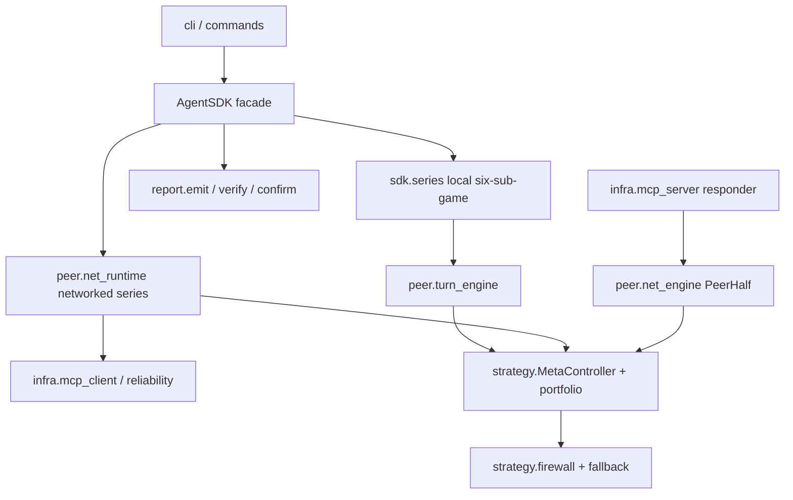
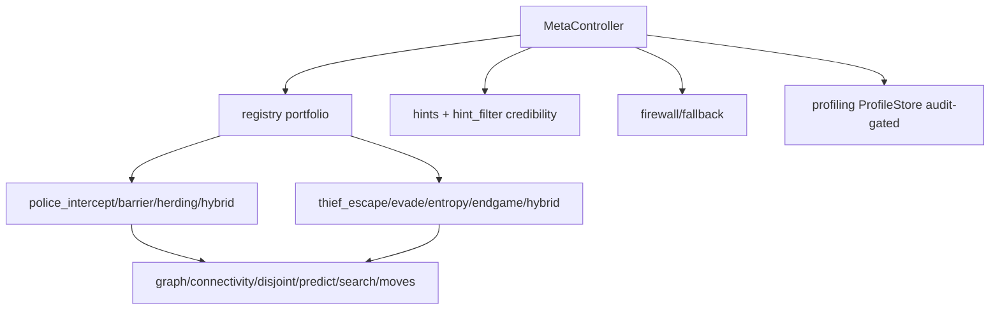
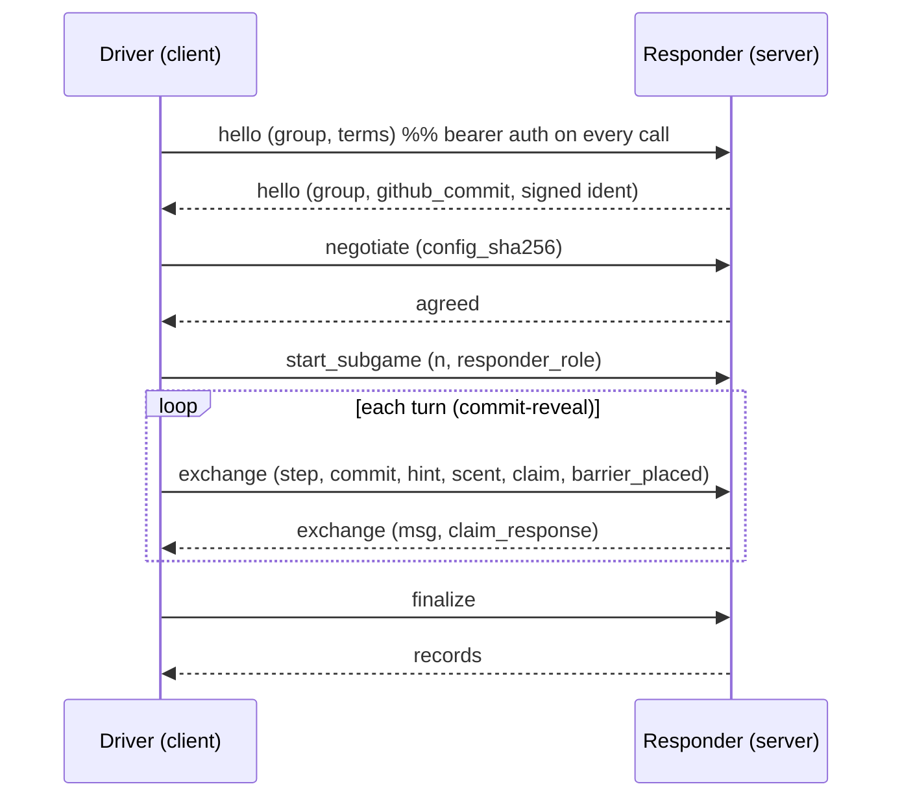

# Architecture — Police/Thief P2P Agent

This document covers the C4 views, module/class structure, deployment/network view,
and the protocol + counted-match sequence diagrams. Diagrams are Mermaid (text source
so they render on GitHub and diff cleanly). The two repositories (`thief_agent`,
`thief_agent`) are byte-identical except the package name and the natural-role/group
constants; each is an independent, installable Python package.

## C4 — Level 1: System context
```mermaid
graph LR
  subgraph Team amireman
    P[thief_agent peer]
    T[thief_agent peer]
  end
  OPP[Opponent team peer]
  GM[Gmail API]
  P <-->|FastMCP / HTTP(S) commit-reveal| OPP
  T <-->|FastMCP / HTTP(S) commit-reveal| OPP
  P -->|signed JSON result report| GM
  T -->|signed JSON result report| GM
```

## C4 — Level 2: Containers (per peer, one process)


## C4 — Level 3: Components (strategy)


## C4 — Level 4: Code (see the module map below and `docs/API.md`).

## Module / package map
- `domain/` — board, rules, capture, scoring, smell, crypto, protocol (pure game logic).
- `strategy/` — BrainBase, MetaController, portfolio brains, shared graph/search
  algorithms, firewall+fallback, belief, profiling, hints, production factory.
- `peer/` — turn_engine (local), net_engine (`PeerHalf`), net_driver, net_runtime,
  handshake, audit, sealing, watchdog, deadline, state_machine.
- `infra/` — mcp_server, mcp_client, reliability, idempotency, serve, gatekeeper,
  tunnel, gmail_report/gmail_auth/gmail_cli.
- `report/` — artifacts, emit, verify, confirm (two-peer), report_writer, schemas, ids.
- `sdk/` — AgentSDK single entry point + series orchestration.
- `sim/` — engine, batch, seeds, tournament, tuning, evaluation, metrics, rehearsal,
  opponents/ (baseline, tricky, reference, latency, registry).
- `gui/` — replay_data/verify/controls (replay viewer), board_view/heatmap/
  status_banner/event_log/window (local-truth GUI).

## Deployment / network view
```mermaid
graph LR
  subgraph Machine A (police)
    PA[police serve :port] -->|0.0.0.0| TAP[tunnel adapter]
  end
  subgraph Machine B (thief / opponent)
    TB[thief serve :port] -->|0.0.0.0| TBP[tunnel adapter]
  end
  TAP -->|public HTTPS URL| INET((Internet))
  TBP -->|public HTTPS URL| INET
  INET -->|bearer-auth MCP| PA
  INET -->|bearer-auth MCP| TB
```
Localhost mode skips the tunnel (`http://127.0.0.1:<port>/mcp`). Public counted matches
require an `https://` endpoint (enforced by `infra.tunnel.validate_public_endpoint`).

## Protocol sequence (one networked sub-game)


## Counted-match final confirmation (P22)
```mermaid
sequenceDiagram
  participant D as Driver
  participant R as Responder
  Note over D,R: after 6 sub-games + local audit
  D->>D: final = role-symmetric summary; h = SHA256(canonical(final))
  D->>R: confirm (final)
  R->>R: h' = SHA256(canonical(final)); sign {group,h'} with OWN key
  R-->>D: confirmation (group, final_sha256, signature)
  D->>D: sign {group,h} with OWN key; require h==h', two distinct peers
  Note over D,R: both signed confirmations retained; forgery fails under peer key
```
